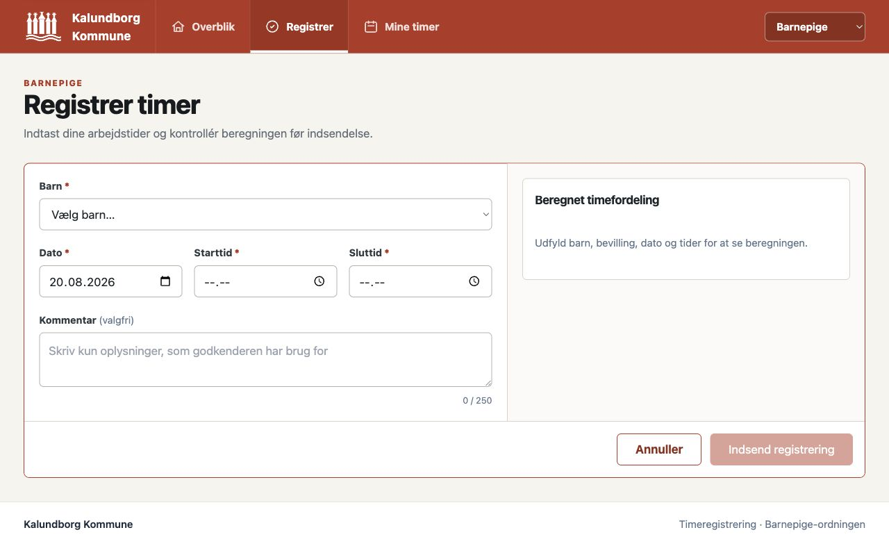

# Barnepige Timeregistrering

Webbaseret system til registrering og godkendelse af timer for barnepiger i Kalundborg Kommune.

> **Bemærk:** Alle navne, MA-numre, børn og timeregistreringer vist i screenshots og i databasen er **mockdata og testdata** genereret udelukkende til test- og demonstrationsformål. Ingen persondata indgår.


## Quick Start

Kræver Node.js 22.17.x (se `.nvmrc`).

```bash
# Installer dependencies
npm ci

# Start både backend og frontend
npm run dev

# Eller start separat:
npm run dev:backend   # Backend på http://localhost:3001
npm run dev:frontend  # Frontend på http://localhost:5173

# Kør backendens domæne- og API-tests
npm test
```

## Demo Data

Kør seed script for at oprette demo data:

```bash
node backend/seed-demo.js      # Basis: 3 barnepiger, 4 børn
node backend/seed-extended.js   # Udvidet: 10 barnepiger, 15 børn, 58 registreringer
node backend/seed-large.js      # Stort datasæt til performance test
```

## Features

### 3-rolle system

Systemet har tre demo-rollevisninger. Rolle-dropdownen er endnu ikke egentlig
login eller adgangskontrol og må derfor ikke bruges som sikkerhedsgrænse:

| Rolle | Rettigheder |
|-------|-------------|
| **Administrator** | Fuld adgang: administrer børn, barnepiger, bevillinger, godkend/afvis timer, eksporter CSV, lønregistrering |
| **Godkender** | Godkend/afvis timeregistreringer, adgang til admin via tandhjulsknap |
| **Barnepige** | Se tilknyttede børn, registrer timer, se egne registreringer og status |

Rollevalg sker via dropdown i headeren.

### Admin Dashboard

Overblik med opsummeringskort for afventende godkendelser, godkendt i dag, antal børn og barnepiger. Viser seneste afventende registreringer med direkte links.


### Godkendelse af timer

Komplet godkendelsesworkflow med tre tabs: Afventer, Godkendte og Afviste.


**Funktioner:**
- **Detaljeret/Kompakt visning** — skift mellem kortvisning og tabelvisning
- **Opsummeringskort** — afventende registreringer og antal der overskrider bevilling
- **Tillægsopsummering** — total timer fordelt på Normal, Aften, Nat, Lørdag, Søn/Hellig
- **Batch-godkendelse** — vælg flere registreringer og godkend samlet med "Vælg alle"
- **Filtrering** — søg på navn/MA-nummer, filtrer pr. barn og barnepige
- **Sortering** — barnepige (A-Å/Å-A), barn, dato (nyeste/ældste), timer
- **Periode-indstilling** — konfigurerbar månedsinterval (f.eks. d. 1-31 eller d. 16-15) med historik
- **Bevillingsstatus** — progressbar pr. registrering med farveindikator (grøn/gul/rød)
- **Overskridelses-advarsel** — rød markering af rækker der overskrider bevilling
- **Inline redigering** — rediger dato og tider direkte i tabellen
- **Lønregistrering** — marker godkendte timer som lønregistreret
- **CSV eksport** — eksporter alle registreringer til CSV-fil
- **Afvisning med årsag** — popup modal til indtastning af afvisningsårsag

### Børneadministration

CRUD-operationer for børn med bevillingsopsætning.


**Funktioner:**
- Søgefelt (navn)
- Bevillingstype pr. barn (uge, måned, kvartal, halvår, år, specifikke ugedage)
- Rammebevilling som en separat årlig pulje, der vælges eksplicit ved registrering
- Ekstra bevillinger — opret, rediger og slet supplerende bevillinger pr. barn
- Tilknytning af barnepiger til børn
- Visning af forbrugt vs. bevilget timer

### Barnepige-administration

CRUD-operationer for barnepiger med MA-nummer validering.


**Funktioner:**
- Søgefelt (navn/MA-nummer)
- MA-nummer validering (præcis 8 cifre, zero-padded)
- Oversigt over tilknyttede børn som farvede badges

### Barnepige Dashboard

Barnepigen ser sine tilknyttede børn med bevillingsstatus og hurtige genveje.


**Funktioner:**
- Kort pr. tilknyttet barn med bevillingstype og forbrug
- Progress bar for bevillingsstatus med farveindikator
- Advarselsindikator ved bevillingsoverskridelse
- Periodevisning (f.eks. uge-interval eller måned-interval)
- Direkte link til timeregistrering pr. barn
- Hurtig oversigt: antal børn, registreringer, genveje til ny registrering og mine timer

### Registrer timer

Formular til timeregistrering med automatisk tillægsberegning.



**Funktioner:**
- Vælg barn fra dropdown (forudfyldt via direkte link fra dashboard)
- Datovælger med blokering af fremtidige datoer (visuel advarsel)
- Start/slut tid med kvarters-afrunding (12:07 → 12:15)
- Live preview af beregnede tillæg før indsendelse
- Valg mellem normal bevilling og rammebevilling
- Advarsel ved bevillingsoverskridelse

### Mine Registreringer

Barnepigen kan følge status på indsendte timer.


**Funktioner:**
- Tabs: Afventer, Godkendt, Afvist
- Tillægsfordeling pr. registrering (Normal, Aften, Nat, Lørdag, Søn/Hellig)
- Advarsler ved bevillingsoverskridelse
- Kommentarer og afvisningsårsager synlige

### Helligdage

Administration af helligdage med integration til Kalendarium.dk API.


**Funktioner:**
- Officielle danske helligdage hentet live fra Kalendarium.dk API
- Bevægelige helligdage med faktiske datoer (f.eks. Påskedag → 5. april 2026)
- Klassifikation: Helligdag, Kirkedag, Mærkedag med farvekodede badges
- Årsnavigation — skift frit mellem år
- "Næste helligdag" banner med nedtælling
- Wikipedia-links til hver helligdag
- Brugerdefinerede helligdage (CRUD) — tilføj egne helligdage med dato, navn, tidsrum og gentagelse
- Dimmet visning af passerede datoer, fremhævning af dagens dato

### Mobilvisning

Responsivt design med dedikeret mobilvisning.


**Funktioner:**
- Desktop/Mobil toggle i header
- Automatisk kompakt visning på mobile enheder
- Tabeller konverteres til kompakt layout
- Tilpassede filtre og navigation
- Batch-godkendelse fungerer også på mobil

## Tillægsregler

Det fulde, versionsstyrede regelsæt og de åbne forretningsafklaringer findes i
[`docs/BEREGNINGSREGLER.md`](docs/BEREGNINGSREGLER.md).

Alle arbejdstimer registreres som grundtimer. Tillægstimer beregnes oven i
grundtimerne og fordeles automatisk efter tidspunkt og ugedag:

### Hverdage (mandag-fredag)
| Tid | Kategori |
|-----|----------|
| 00:00-06:00 | Nattillæg |
| 06:00-17:00 | Intet tillæg |
| 17:00-23:00 | Aftentillæg |
| 23:00-23:59 | Nattillæg |

### Lørdag
| Tid | Kategori |
|-----|----------|
| 00:00-06:00 | Nattillæg |
| 06:00-08:00 | Intet tillæg |
| 08:00-23:59 | Lørdagstillæg |

### Søn- og helligdage
| Tid | Kategori |
|-----|----------|
| 00:00-23:59 | Søndags- og helligdagstillæg |

**Beregningshelligdage overruler andre tillæg!** Regelsættet indeholder faste og
bevægelige datoer. Kalendarium.dk bruges til kalenderoversigten, mens selve
lønberegningen bruger det versionsstyrede lokale regelsæt. Brugerdefinerede
helligdage kan tilføjes via admin.

Timer rundes op til nærmeste kvarter. Tidsformat er decimalt (0,25 / 0,50 / 0,75 / 1,00).

## Bevillingstyper

| Type | Periode |
|------|---------|
| **Uge** | Mandag til søndag |
| **Måned** | Konfigurerbar (f.eks. d. 1-31 eller d. 16-15) |
| **Kvartal** | Q1-Q4 |
| **Halvår** | H1 (jan-jun) / H2 (jul-dec) |
| **År** | 1. jan til 31. dec |
| **Specifikke ugedage** | Timer pr. valgt ugedag pr. uge |
| **Rammebevilling** | Separat årlig pulje, der vælges ved registrering |
| **Ekstra bevilling** | Supplerende bevilling med valgfri periode |

Bevillinger er pr. barn, ikke pr. barnepige. Både afventende og godkendte registreringer tæller med i forbruget.

## Månedsinterval

Administratorer kan konfigurere månedsintervallet for bevillingsperioder:

- Standard: d. 1 til d. 31 (kalendermåned)
- Alternativ: f.eks. d. 16 til d. 15 (forskudt måned)
- Ændringer gælder fra dags dato — ingen retroaktive ændringer
- Fuld historik over intervalændringer

## Tech Stack

- **Frontend**: React 19 + Vite + Tailwind CSS + React Router v7
- **Backend**: Node.js + Express
- **Database**: SQLite (better-sqlite3)
- **Styling**: Kalundborg Kommune branding (#B54A32)
- **Deployment**: Render.com konfiguration med health check og persistent SQLite-disk

## API Endpoints

### Børn
| Metode | Endpoint | Beskrivelse |
|--------|----------|-------------|
| `GET` | `/api/children` | Alle børn med tilknyttede barnepiger |
| `GET` | `/api/children/:id` | Barn med barnepiger og bevillingsstatus |
| `POST` | `/api/children` | Opret barn |
| `PUT` | `/api/children/:id` | Opdater barn |
| `DELETE` | `/api/children/:id` | Slet barn |

### Barnepiger
| Metode | Endpoint | Beskrivelse |
|--------|----------|-------------|
| `GET` | `/api/caregivers` | Alle barnepiger med tilknyttede børn |
| `GET` | `/api/caregivers/:id` | Barnepige med tilknyttede børn |
| `POST` | `/api/caregivers` | Opret barnepige |
| `PUT` | `/api/caregivers/:id` | Opdater barnepige |
| `DELETE` | `/api/caregivers/:id` | Slet barnepige |

### Timeregistreringer
| Metode | Endpoint | Beskrivelse |
|--------|----------|-------------|
| `GET` | `/api/time-entries` | Registreringer (filtre: status, child_id, caregiver_id, datointerval) |
| `GET` | `/api/time-entries/:id` | Enkelt registrering |
| `POST` | `/api/time-entries` | Opret registrering med tillægsberegning |
| `POST` | `/api/time-entries/preview` | Preview tillægsberegning uden oprettelse |
| `PUT` | `/api/time-entries/:id/approve` | Godkend registrering |
| `PUT` | `/api/time-entries/:id/reject` | Afvis registrering (kræver årsag) |
| `PUT` | `/api/time-entries/:id/payroll` | Marker som lønregistreret |
| `POST` | `/api/time-entries/batch-approve` | Batch-godkend flere registreringer |

### Ekstra bevillinger
| Metode | Endpoint | Beskrivelse |
|--------|----------|-------------|
| `GET` | `/api/extra-grants` | Alle ekstra bevillinger (valgfrit: `?child_id=`) |
| `GET` | `/api/extra-grants/:id` | Enkelt ekstra bevilling |
| `POST` | `/api/extra-grants` | Opret ekstra bevilling |
| `PUT` | `/api/extra-grants/:id` | Opdater ekstra bevilling |
| `DELETE` | `/api/extra-grants/:id` | Slet ekstra bevilling |

### Helligdage
| Metode | Endpoint | Beskrivelse |
|--------|----------|-------------|
| `GET` | `/api/holidays` | Alle brugerdefinerede helligdage |
| `GET` | `/api/holidays/kalendarium/:year` | Officielle helligdage fra Kalendarium.dk (cached) |
| `POST` | `/api/holidays` | Opret brugerdefineret helligdag |
| `PUT` | `/api/holidays/:id` | Opdater helligdag |
| `DELETE` | `/api/holidays/:id` | Slet helligdag |

### Eksport
| Metode | Endpoint | Beskrivelse |
|--------|----------|-------------|
| `GET` | `/api/export/time-entries` | CSV/JSON eksport (filtre: status, barn, barnepige, dato, format) |
| `GET` | `/api/export/children` | CSV/JSON eksport af børn |

### Indstillinger
| Metode | Endpoint | Beskrivelse |
|--------|----------|-------------|
| `GET` | `/api/settings/month-interval` | Nuværende månedsinterval |
| `GET` | `/api/settings/month-interval/history` | Historik over intervalændringer |
| `PUT` | `/api/settings/month-interval` | Opdater månedsinterval (fra dags dato) |

### Sundhedstjek
| Metode | Endpoint | Beskrivelse |
|--------|----------|-------------|
| `GET` | `/api/health` | API sundhedstjek |
