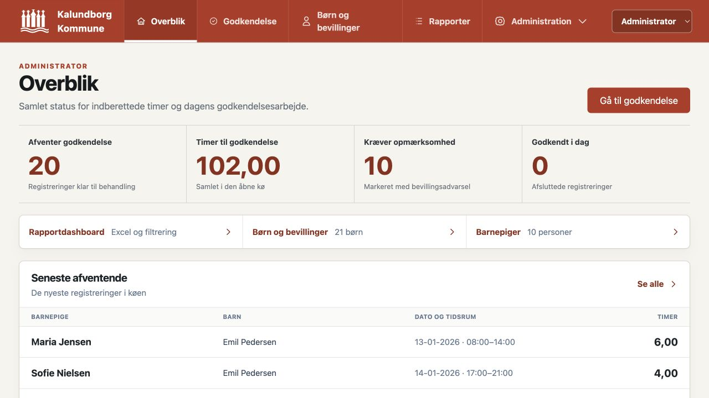
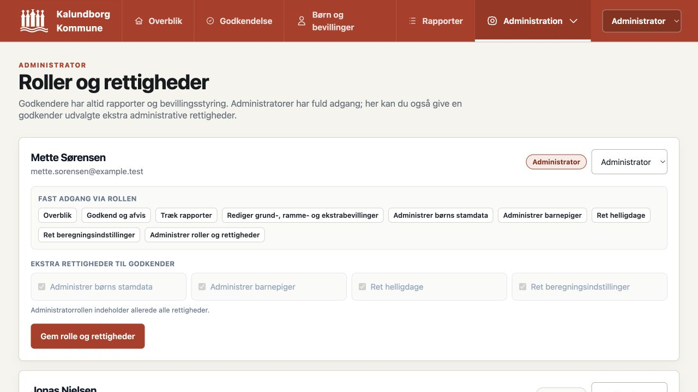
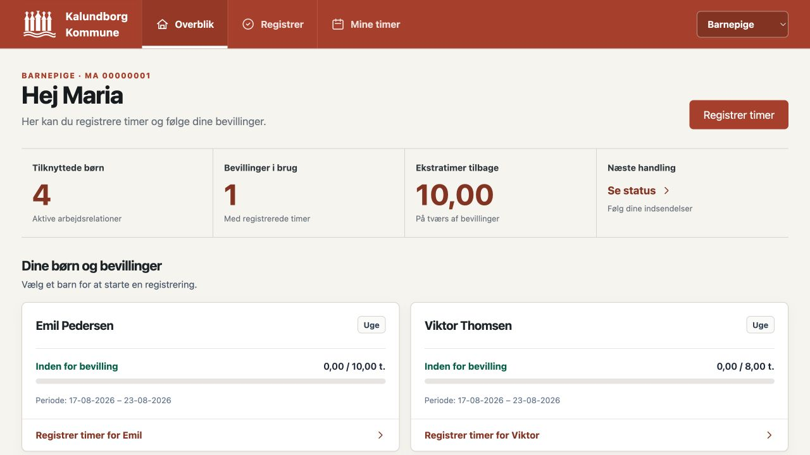
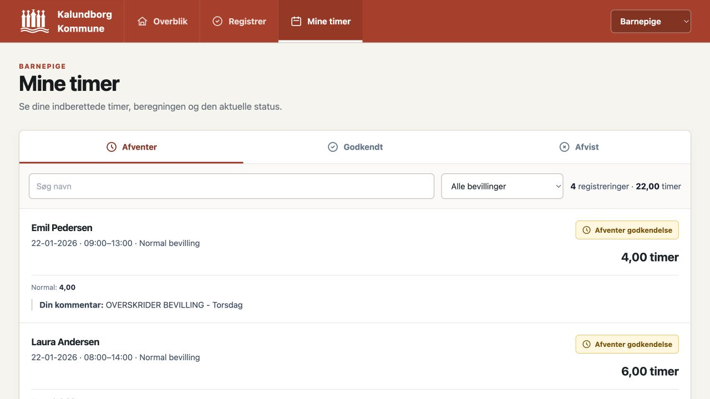
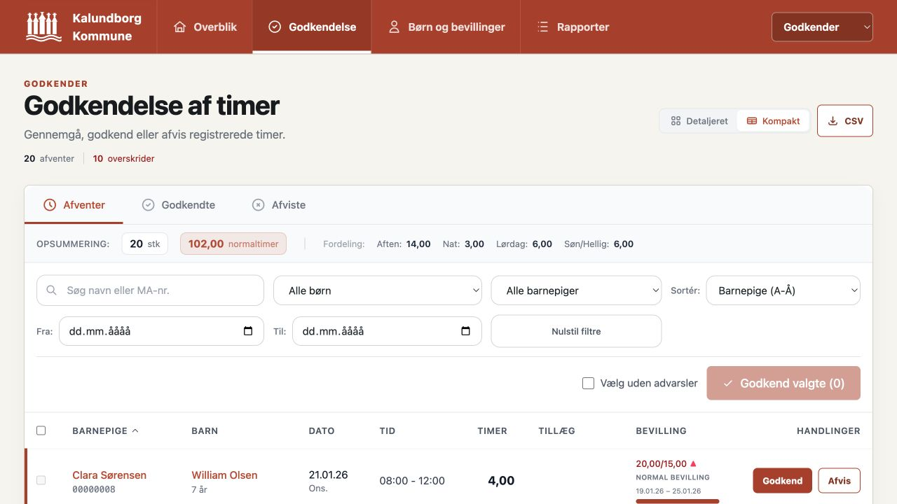
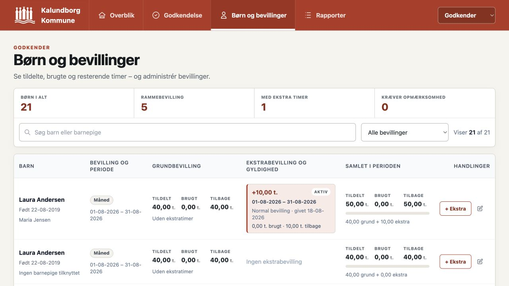
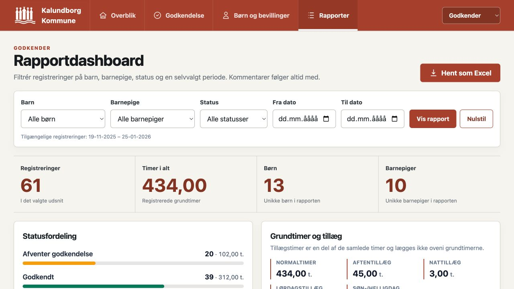

# Barnepige Timeregistrering

En webbaseret løsning til registrering, beregning, godkendelse og rapportering
af timer i Kalundborg Kommunes barnepigeordning.

Løsningen samler barnepigens registrering, godkenderens behandling og den
administrative styring af børn, bevillinger, rapporter og helligdage i ét
responsivt system.

> **Projektstatus:** Løsningen er en fungerende prototype med demo-profiler.
> Profilvælgeren erstatter midlertidigt login og må ikke betragtes som en
> produktionsklar sikkerhedsgrænse.

> **Testdata:** Alle navne, MA-numre, børn, kommentarer og registreringer i
> screenshots og den medfølgende SQLite-database er fiktive testdata.



## Hvad løsningen understøtter

Den centrale arbejdsgang er:

1. En barnepige registrerer dato, tidsrum, barn, bevilling og en valgfri
   kommentar.
2. Systemet beregner grundtimer, tillæg og bevillingsforbrug automatisk.
3. Registreringen sendes til godkendelse med status **Afventer godkendelse**.
4. En godkender gennemgår beregning og bevilling og godkender eller afviser.
5. Registreringer kan efterfølgende filtreres og eksporteres som en formateret
   Excel-rapport.

## Brugeroplevelser og rettigheder

Prototypen har tre adskilte demo-roller: **Barnepige**, **Godkender** og
**Administrator**. Rollen fastlægger kerneadgangen, mens en administrator kan
give en godkender enkelte ekstra administrative rettigheder.

| Funktion | Barnepige | Godkender | Administrator |
|---|:---:|:---:|:---:|
| Registrere timer | Ja | – | – |
| Se egne timer og status | Ja | – | – |
| Se samlet dashboard | – | Ja | Ja |
| Godkende og afvise timer | – | Ja | Ja |
| Se rapportdashboard og hente Excel | – | Ja | Ja |
| Redigere grund- og rammebevilling | – | Ja | Ja |
| Tildele og administrere ekstrabevilling | – | Ja | Ja |
| Administrere børns stamdata | – | Kan tildeles | Ja |
| Administrere barnepiger | – | Kan tildeles | Ja |
| Administrere helligdage | – | Kan tildeles | Ja |
| Ændre beregningsindstillinger | – | Kan tildeles | Ja |
| Administrere roller og rettigheder | – | – | Ja |

Demo-profilen **Mette Sørensen** er administrator. **Jonas Nielsen** og
**Lene Hansen** er godkendere; Lene har desuden fået adgang til at rette
helligdage som eksempel på en individuelt tildelt rettighed.

Den detaljerede rettighedsmodel findes i
[`docs/RETTIGHEDER.md`](docs/RETTIGHEDER.md).



## Barnepigens arbejdsgang

Barnepigen har tre enkle indgange:

- **Overblik** viser tilknyttede børn, aktuelle bevillingsperioder,
  bevillingsforbrug og resterende ekstratimer.
- **Registrer** indeholder arbejdsrelation, valg af barn og bevilling,
  dato/tid, kommentar og automatisk beregningskontrol.
- **Mine timer** samler afventende, godkendte og afviste registreringer med
  beregning, kommentarer og status.





## Godkendelse af timer

Godkendelsesvisningen samler alle registreringer i statusfanerne **Afventer**,
**Godkendte** og **Afviste**.

Godkenderen kan blandt andet:

- søge og filtrere ensartet på tværs af statusser;
- filtrere efter barn, barnepige og selvvalgt datointerval;
- se tidsrum, tillæg, kommentar, bevillingskilde og aktuel periode;
- se tydelige advarsler ved bevillingsoverskridelser;
- godkende eller afvise enkeltregistreringer;
- massevælge og godkende registreringer uden bevillingsadvarsel;
- skifte mellem kompakt og detaljeret visning.

Godkenderrollen har desuden fast adgang til rapportdashboardet samt til at
redigere grund-, ramme- og ekstrabevillinger. Børnenes stamdata kan kun ændres
af en administrator eller en godkender, der specifikt har fået den ekstra
rettighed.



## Børn og bevillinger

Bevillingsoversigten adskiller bevidst tre tal:

1. **Grundbevilling** – barnets normale bevilling eller rammebevilling.
2. **Ekstrabevilling** – supplerende timer med egen gyldighedsperiode,
   tildelingsdato og status.
3. **Samlet rådighed** – grundbevilling plus aktive ekstratimer i perioden.

Løsningen understøtter uge, måned, kvartal, halvår, år, specifikke ugedage og
en selvstændig årlig rammebevilling. Bevillinger er knyttet til barnet og deles
af de barnepiger, der er tilknyttet barnet.

Afventende og godkendte registreringer tæller med i bevillingsforbruget, mens
afviste registreringer ikke gør.



## Rapportdashboard og Excel

Rapportdashboardet kan filtrere registreringer efter:

- barn;
- barnepige;
- status;
- fra- og til-dato.

Dashboardet viser registreringer, grundtimer, tillæg, statusfordeling og alle
registrerede kommentarer. Det samme udsnit kan hentes som en formateret
`.xlsx`-fil med oversigt og detaljer.



## Beregningsmotor

Arbejdstiden afrundes op til nærmeste kvarter og opdeles automatisk i:

- normaltimer;
- aftentillæg;
- nattillæg;
- lørdagstillæg;
- søn- og helligdagstillæg.

Beregningen håndterer blandt andet tidsrum over midnat, bevægelige helligdage,
brugerdefinerede helligdage og periodeskift. Beregningsreglerne er
versionsstyrede og dokumenteret i
[`docs/BEREGNINGSREGLER.md`](docs/BEREGNINGSREGLER.md).

### Standardgrænser

| Dag | Tidsrum | Kategori |
|---|---|---|
| Mandag–fredag | 00:00–06:00 | Nattillæg |
| Mandag–fredag | 06:00–17:00 | Normaltid |
| Mandag–fredag | 17:00–23:00 | Aftentillæg |
| Mandag–fredag | 23:00–24:00 | Nattillæg |
| Lørdag | 00:00–06:00 | Nattillæg |
| Lørdag | 06:00–08:00 | Normaltid |
| Lørdag | 08:00–24:00 | Lørdagstillæg |
| Søn- og beregningshelligdage | Hele døgnet | Søn-/helligdagstillæg |

## Helligdage

Kalenderoversigten henter officielle danske helligdage fra Kalendarium.dk og
har en lokal fallback. Godkendere med den relevante rettighed kan desuden
oprette tidsafgrænsede eller tilbagevendende lokale helligdage.

Kalender-API'et bruges til oversigten, mens lønberegningen anvender det
versionsstyrede lokale regelsæt og de lokale administrative tilføjelser.

## Kom hurtigt i gang

### Krav

- Node.js `22.17.x` – se [`.nvmrc`](.nvmrc)
- npm 10 eller nyere

### Installation og lokal opstart

```bash
npm ci
npm run dev
```

Tjenesterne starter på:

- Frontend: [http://localhost:5173](http://localhost:5173)
- Backend/API: [http://localhost:3001](http://localhost:3001)
- Health check: [http://localhost:3001/api/health](http://localhost:3001/api/health)

### Nyttige kommandoer

| Kommando | Formål |
|---|---|
| `npm run dev` | Start frontend og backend samtidigt |
| `npm run dev:frontend` | Start kun Vite-frontenden |
| `npm run dev:backend` | Start kun Express-API'et |
| `npm run build` | Opret produktionsbuild af frontenden |
| `npm test` | Kør domæne- og API-tests |
| `npm run recalculate:time-entries` | Genberegn gemte registreringer efter regelsættet |

## Demo- og testdata

Repositoryets SQLite-database indeholder det datasæt, som screenshots er taget
med. Databasen ligger i `backend/src/db/database.sqlite`.

Seed-scripts kan bruges til at oprette alternative datasæt:

```bash
node backend/seed-demo.js       # Mindre demonstrationsdatasæt
node backend/seed-extended.js   # Udvidet datasæt med flere statusser
node backend/seed-large.js      # Større datasæt til belastningstest
```

Tag en kopi af databasen først, hvis eksisterende lokale testdata skal
bevares.

## Teknologi og struktur

| Lag | Teknologi |
|---|---|
| Frontend | React 19, Vite, React Router og Tailwind CSS |
| Backend | Node.js og Express |
| Database | SQLite via `better-sqlite3` |
| Excel | ExcelJS |
| Test | Node.js' indbyggede test runner |
| Design | Responsivt Kalundborg-inspireret tema med kommunens røde profilfarve |

```text
BP3/
├── backend/
│   ├── src/routes/       # API-ruter
│   ├── src/services/     # Beregning, bevilling, rapporter og rettigheder
│   ├── src/db/           # Schema og SQLite-database
│   └── test/             # Domæne- og API-tests
├── frontend/
│   └── src/
│       ├── components/   # Fælles UI og rettighedsvagter
│       └── pages/        # Godkender- og barnepigevisninger
├── docs/                 # Regler, rettigheder og screenshots
└── render.yaml           # Deploymentkonfiguration
```

## Centrale API-områder

- `/api/time-entries` – registrering, preview, godkendelse, afvisning og audit.
- `/api/children` – børn, relationer, bevillingsstatus og afgrænset redigering af bevillinger.
- `/api/extra-grants` – tidsafgrænsede ekstrabevillinger.
- `/api/caregivers` – barnepiger og arbejdsrelationer.
- `/api/reports` – filtrerede rapportdata og Excel-download.
- `/api/approvers` – godkender- og administratorprofiler, roller og rettigheder.
- `/api/holidays` – officielle og lokalt administrerede helligdage.
- `/api/settings` – beregningsindstillinger og historik.

## Kvalitet og kendte afgrænsninger

- Beregningsmotoren og de centrale API-flows er dækket af automatiske tests.
- Administrative API-handlinger kontrollerer den valgte profils rolle og
  rettigheder.
- UI'et er responsivt og har semantiske labels til centrale formularer og
  tabeller.
- Login og servervaliderede sessioner skal implementeres, før løsningen kan
  betragtes som produktionsklar. Den nuværende rolle- og profilvælger er kun
  beregnet til demo og lokal afprøvning.
- Persondata, adgangslogning, backup, retention og driftssetup skal afklares før
  anvendelse med virkelige borgere og medarbejdere.
